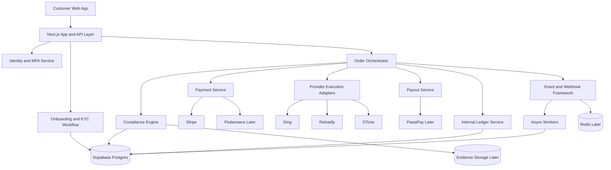

# Afrisendiq Compliance-Safe Scalable Architecture

Last updated: March 27, 2026

## Purpose

This document reviews the current Afrisendiq backend and defines a target architecture that is:

- compliance-safe for regulated payment and payout partners
- scalable beyond the current single-rail prototype
- explicit about money movement boundaries
- designed around automation, auditability, and partner trust

This is an engineering architecture document, not legal advice. Patriot Act, AML, KYC, sanctions, CIP, and recordkeeping obligations must still be validated with legal counsel and any sponsoring or regulated partners.

## Executive Summary

Afrisendiq already has useful foundations:

- a Stripe payment gateway adapter
- an idempotent Stripe webhook handler
- a JIT order state machine
- transaction guard logic for limits, velocity, liquidity, and rate limiting
- Supabase-backed durable order and webhook persistence

Afrisendiq does not yet have a partner-ready compliance and identity stack. The biggest gaps are:

- no production-grade customer identity and onboarding model
- no durable internal double-entry ledger
- no payout orchestration service for partners like PawaPay
- no general payment abstraction beyond Stripe
- no queue-backed webhook and event processing model
- AML logic that is still too shallow for partner trust

The correct target model is:

1. Keep Afrisendiq as a platform orchestrator, not a bank or wallet.
2. Treat all customer funds as externally processed by regulated payment partners.
3. Maintain an internal ledger only for order, settlement, fee, refund, reserve, and reconciliation tracking.
4. Introduce a dedicated compliance engine for onboarding, limits, sanctions, device risk, fraud scoring, and case management.
5. Build all external integrations as adapters behind stable service interfaces.
6. Make webhook ingestion first-class and idempotent across Stripe, Flutterwave later, and PawaPay later.

## Current State Review

### What already exists

The current codebase already contains meaningful architecture building blocks:

- Stripe client singleton in [app/lib/stripe.ts](../app/lib/stripe.ts)
- Stripe payment adapter in [app/lib/stripeGateway.ts](../app/lib/stripeGateway.ts)
- durable Stripe webhook handler in [app/api/stripe/webhook/route.ts](../app/api/stripe/webhook/route.ts)
- JIT purchase state machine in [app/lib/jitPurchaseEngine.ts](../app/lib/jitPurchaseEngine.ts)
- transaction guard engine in [app/lib/transactionStateEngine.ts](../app/lib/transactionStateEngine.ts)
- durable order, settlement, guard audit, and webhook persistence in [app/lib/supabaseOrders.ts](../app/lib/supabaseOrders.ts)
- operational schema in [supabase/schema.sql](../supabase/schema.sql)

### What is prototype-grade today

Some of the current implementation is useful for local control flow but not strong enough for partner review:

- AML is only a small score function in [app/lib/aml.ts](../app/lib/aml.ts)
- the internal transaction log in [app/lib/ledger.ts](../app/lib/ledger.ts) is in-memory and not accounting-grade
- transaction rate limiting, velocity, liquidity reservations, and idempotency still rely on in-memory stores in [app/lib/transactionStateEngine.ts](../app/lib/transactionStateEngine.ts)
- there is no customer auth, MFA, passkey, onboarding, or case review workflow yet
- webhook handling is strong for Stripe but not generalized into a shared event intake framework
- no payout service adapter exists yet for PawaPay

### Practical conclusion

Afrisendiq does not need a ground-up rewrite. It needs a controlled transition from:

- a solid JIT prototype with durable orders

to:

- a service-oriented orchestration platform with identity, compliance, ledger, payout, webhook, and reconciliation layers

## Target Architecture Principles

### Principle 1: No customer wallet

Afrisendiq should not hold customer balances or present any stored-value wallet UX unless Afrisendiq later becomes licensed and re-architects around safeguarding obligations.

### Principle 2: Internal ledger only

The ledger is not a customer wallet. It exists only to track:

- customer charges
- processor fees
- provider costs
- payout obligations
- refunds
- reserves and holds
- realized margin
- reconciliation breaks

### Principle 3: Progressive compliance

Collect the minimum information necessary at first, then step up identity verification and authentication only when transaction size, partner requirements, velocity, or risk signals justify it.

### Principle 4: Adapter-based partner integrations

Stripe, Flutterwave later, PawaPay later, and provider rails should all sit behind stable internal interfaces so Afrisendiq can swap or add partners without rewriting core flow logic.

### Principle 5: Event-driven automation with durable fallback

Every payment confirmation, payout status change, provider response, and compliance decision should become a durable event. Webhooks must be idempotent, replayable, and dead-lettered when they fail.

## Target System Components

## 1. API Gateway and App Layer

Keep the Next.js application as the web app and initial backend-for-frontend layer for now.

Responsibilities:

- customer-facing APIs
- authenticated session handling
- quote creation
- checkout initiation
- onboarding screens
- compliance review UX surfaces
- partner-safe internal admin tools

Later-scale note:

When traffic or partner complexity increases, split heavy async flows into separate worker services while keeping Next.js as the customer UI layer.

## 2. Identity and Access Service

Add a dedicated identity service using Supabase Auth or a similar managed auth system. Because Afrisendiq already uses Supabase, Supabase Auth is the lowest-friction starting point.

Required capabilities:

- customer account creation
- email verification
- phone verification
- passkey support
- step-up MFA
- session management
- device binding and trusted device records
- admin versus customer role separation

Required data model additions:

- customers
- customer_profiles
- auth_factors
- trusted_devices
- customer_sessions
- customer_risk_profiles

## 3. Payment Service

### Current state

Stripe exists today.

### Target state

Create a formal `PaymentService` abstraction with provider adapters:

- Stripe adapter now
- Flutterwave adapter later

Core responsibilities:

- create payment session or payment intent
- normalize payment status
- support refunds and partial refunds
- persist partner references
- emit payment events
- expose provider capability metadata by corridor and currency

Recommended interface surface:

- `createCheckoutSession()`
- `getPaymentStatus()`
- `refundPayment()`
- `verifyWebhook()`
- `mapProviderEventToCanonicalPaymentEvent()`

Canonical payment statuses:

- `created`
- `requires_action`
- `authorized`
- `paid`
- `failed`
- `refunded`
- `chargeback_open`
- `chargeback_won`
- `chargeback_lost`

## 4. Payout Service

### Current state

No payout orchestration layer is present.

### Target state

Introduce a `PayoutService` abstraction now, even if only one partner exists later.

Adapters:

- PawaPay adapter later

Core responsibilities:

- create payout instruction
- validate beneficiary payload
- track payout status
- reconcile partner callbacks and polling
- handle reversals, failures, retries, and manual review

Canonical payout statuses:

- `created`
- `queued`
- `submitted`
- `pending_partner`
- `paid`
- `failed`
- `reversed`
- `manual_review`

Required persistence:

- payout_requests
- payout_attempts
- payout_callbacks
- payout_reconciliation

## 5. Ledger Service

### Required correction

Afrisendiq should not call this a wallet. It should be an internal ledger service only.

### Target state

Replace the simple in-memory transaction log with a durable internal ledger based on immutable entries.

Recommended structure:

- ledger_accounts
- ledger_journals
- ledger_entries
- reconciliation_items

Examples of internal ledger accounts:

- processor_clearing_stripe
- processor_clearing_flutterwave
- provider_payable_reloadly
- provider_payable_ding
- payout_payable_pawapay
- refunds_payable
- afrisendiq_fee_revenue
- compliance_reserve
- chargeback_reserve

Each business event should post balanced entries. Example:

- customer paid via Stripe
- provider cost incurred
- processor fee recognized
- margin realized
- refund issued

This is how finance, audit, and partner due diligence start trusting the platform.

## 6. Compliance Engine

### Current state

The repo has velocity and transaction guard logic plus a small AML scorer. That is useful but insufficient.

### Target state

Introduce a dedicated compliance engine with these modules:

- onboarding eligibility rules
- sanctions and watchlist screening
- customer limits engine
- fraud risk engine
- device and session risk engine
- transaction monitoring
- case management and manual review
- enhanced due diligence routing

Core rule families:

- per-transaction amount limits
- daily, weekly, and monthly customer limits
- country and corridor restrictions
- payment method risk rules
- name mismatch and duplicate identity rules
- impossible travel and device anomalies
- high-risk phone, email, IP, and BIN heuristics
- transaction structuring detection
- dormant-account reactivation checks

Recommended tables:

- compliance_profiles
- sanctions_screenings
- fraud_decisions
- transaction_monitoring_alerts
- compliance_cases
- case_actions
- customer_limits

Decision outcomes:

- `allow`
- `allow_with_step_up`
- `hold_for_review`
- `block`

## 7. Webhook Handler Framework

### Current state

Stripe webhook processing is already important and relatively mature.

### Target state

Generalize webhook handling into a shared framework used by:

- Stripe
- Flutterwave later
- PawaPay later
- provider callbacks later

Required behavior:

- signature verification per partner
- idempotency key storage
- raw payload retention
- canonical event normalization
- retry-safe processing
- dead-letter queue for failures
- replay tooling for operations

Recommended tables:

- inbound_webhook_events
- normalized_domain_events
- dead_letter_events
- event_processing_attempts

Operational requirement:

Never put business logic directly inside a raw webhook controller beyond verification, persistence, dedupe, and dispatch.

## 8. Order Orchestrator

Keep the existing JIT order engine as the seed of the orchestration layer, but extend it.

It should become the canonical orchestrator for:

- onboarding state gates
- quote generation
- compliance pre-check
- payment session creation
- payment confirmation
- provider execution
- payout initiation when applicable
- settlement and refund handling

Required upgrade:

Move temporary in-memory guard and reservation state into durable storage plus a short-lived cache layer like Redis later.

## 9. Data Stores

### Keep now

- Supabase Postgres for durable records

### Add later

- Redis for rate limits, idempotency accelerators, short-lived reservations, OTP throttling, and session risk caches
- object storage for compliance evidence and document artifacts

### Data categories

- operational orders
- compliance evidence
- accounting ledger
- webhook/event store
- onboarding and identity data

Sensitive data must be logically separated from public catalog data.

## 10. Observability and Trust Layer

Required from partner-review perspective:

- structured audit logs
- immutable compliance decision trail
- reconciliation dashboards
- payout and webhook health dashboards
- failed event replay tooling
- suspicious activity case visibility
- maker-checker controls for sensitive admin actions

## Recommended Target Diagram

## Compliance-Safe Customer Onboarding Design

## Goal

Create onboarding that is:

- customer-friendly
- low-friction at first touch
- progressively invasive only when justified
- compatible with AML, KYC, CIP, and partner trust expectations

## Recommended onboarding model: tiered progressive onboarding

### Tier 0: Guest discovery

Customer can:

- browse pricing
- compare providers
- build a quote

Customer cannot:

- complete regulated or high-risk transactions
- create recurring activity
- access beneficiary or payout features requiring identity

Collected data:

- device fingerprint
- IP-derived country
- abuse-prevention telemetry

### Tier 1: Lightweight account creation

Customer sees a very simple first-use flow:

1. enter email
2. verify email
3. enter mobile number
4. verify mobile number with OTP
5. create account using passkey-first sign-in or passwordless magic link

Collected profile data:

- full legal name
- email
- mobile number
- country of residence

Purpose:

- create a recoverable customer account
- establish contact points
- start a risk profile

### Tier 2: First transaction KYC/CIP

Only when the customer tries to transact, collect:

- legal first and last name
- residential address
- date of birth
- country of citizenship or residence as required by partner rules
- last 4 of SSN or tax identifier if required by partner and jurisdiction

Verification flow:

- sanctions and watchlist screening
- phone and email ownership confirmed
- address plausibility checks
- document-free verification first when available through partner or vendor
- fall back to ID document plus selfie only when required

This is the best balance between conversion and compliance.

### Tier 3: Enhanced verification

Trigger enhanced due diligence when any of the following occur:

- higher cumulative transaction thresholds
- high-risk corridor
- payout use case requiring beneficiary scrutiny
- sanctions or PEP close match
- device or payment fraud signal
- partner-specific requirement

Additional requirements may include:

- government ID upload
- selfie liveness
- proof of address
- source-of-funds explanation
- manual compliance review

## Customer-Friendly UX Pattern

### Do this

- ask only for the next necessary data point
- explain why each step is required
- show progress clearly
- defer invasive checks until the user is about to perform a regulated action
- prefill previously provided data
- make failure reasons human and actionable

### Avoid this

- asking for full KYC at homepage entry
- forcing SMS OTP on every login for low-risk returning users
- generic “verification failed” messages without next steps
- mixing product checkout, KYC, and partner errors in one screen

## Recommended onboarding screens

1. Account start
   - email or phone entry
   - short trust copy

2. Verify contact
   - email verification
   - phone OTP

3. Personal details
   - legal name
   - country
   - date of birth only when needed

4. Address and identity check
   - only shown if transaction or partner policy requires it

5. Review and limits
   - show current sending tier and any unlock conditions

6. Success and trust screen
   - explain that the account is verified for a stated level of activity

## 2FA and Authentication Design

## Customer authentication

Use a risk-based MFA model.

### Recommended primary login

- passkeys first
- email magic link fallback
- SMS OTP as backup, not preferred primary for all users

### Recommended step-up triggers

- new device
- new country or unusual IP reputation
- payout setup or sensitive profile change
- high-value transaction
- failed login anomaly

### Why this is customer-friendly

- passkeys reduce password friction
- returning trusted-device users avoid unnecessary repeated OTP prompts
- riskier actions still require strong authentication

## Admin and internal authentication

Admin access must be stricter than customer access.

Required controls:

- phishing-resistant MFA required for all internal users
- passkey or hardware security key preferred
- TOTP backup allowed
- no SMS-only admin MFA
- role-based access control
- maker-checker approval for refunds, payout overrides, limits changes, and manual compliance clears

## Patriot Act and AML/CIP Support Model

Afrisendiq can support Patriot Act and AML expectations by implementing a Customer Identification Program style workflow even if the regulated legal obligation sits with a sponsor or partner.

At minimum, the architecture should support collection and verification of:

- name
- date of birth
- residential address
- taxpayer identifier fragment where required
- sanctions screening outcome
- verification method and evidence trail
- decision timestamp and reviewer if manual

Retention support should include:

- evidence of verification result
- documents or vendor decision IDs when used
- audit logs of customer profile changes
- screening reruns on material changes

## Recommended Implementation Phases

## Phase 1: Partner-ready hardening

- keep Stripe as current payment rail
- introduce `PaymentService` interface and keep Stripe behind it
- create `WebhookService` abstraction around existing Stripe flow
- move rate limiting and idempotency to durable storage or Redis-ready abstraction
- replace in-memory ledger with durable internal journal tables
- create compliance profile and case tables

## Phase 2: Customer identity and onboarding

- add managed auth
- add passkey-first login
- add phone and email verification
- add progressive KYC screens
- add compliance decision service and case queue

## Phase 3: Payout rail and reconciliation

- add `PayoutService` abstraction
- implement PawaPay adapter later
- add payout callback handlers
- build payout reconciliation dashboard

## Phase 4: Scale and resilience

- add Redis for ephemeral controls
- add worker queue for webhook and payout processing
- add dead-letter and replay tooling
- add partner health dashboards and SLA monitoring

## Component Decision Summary

### Payment Service

- present today: Stripe only
- recommended next move: formal service interface now
- recommended later rail: Flutterwave adapter

### Payout Service

- present today: absent
- recommended next move: define abstraction and persistence now
- recommended later rail: PawaPay adapter

### Ledger

- present today: lightweight transaction log plus settlements table
- recommended next move: durable internal journal-based ledger
- explicit rule: not a customer wallet

### Compliance Engine

- present today: basic limits and AML scoring
- recommended next move: real compliance profile, sanctions, fraud, and case management layer

### Webhook Handler

- present today: Stripe webhook flow is good
- recommended next move: generalize as shared event intake and retry framework

## Non-Negotiable Partner Trust Controls

To strengthen partner trust, Afrisendiq should be able to demonstrate:

1. Durable auditability of orders, webhooks, and compliance decisions.
2. Clear money movement boundaries with no hidden customer wallet behavior.
3. Risk-based onboarding and transaction monitoring.
4. Strong admin MFA and role segregation.
5. Evidence retention and replayable webhook/event history.
6. Reconciliation between customer charges, provider execution, refunds, and payouts.

## Recommended Immediate Build Priorities

If Afrisendiq is going to build toward partner readiness without overbuilding too early, the best immediate order is:

1. Formalize PaymentService, PayoutService, WebhookService, and LedgerService interfaces.
2. Add durable compliance and identity tables.
3. Build progressive customer onboarding and step-up MFA.
4. Replace in-memory controls with durable or Redis-backed equivalents.
5. Add PawaPay later only after the orchestration and compliance layers are ready.
